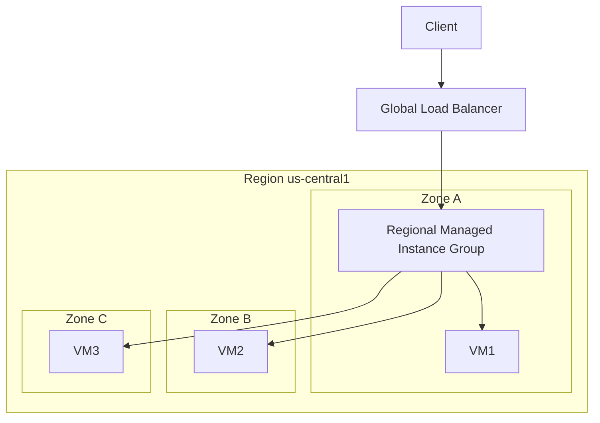

# Infrastructure Modernization: 50 Practice Q&A for GCP Customer Engineer

This document contains 50 rapid-fire questions and answers focused strictly on Infrastructure Modernization. It has been expanded to include the **Why**, the **Trade-offs**, and architectural diagrams for critical concepts to help you defend your answers in the interview.

## Section 1: VM Migrations & Lift-and-Shift

**Q1: What is the primary tool Google provides for migrating on-premises VMs to Compute Engine?**
* **A:** **Migrate to Virtual Machines** (formerly Migrate for Compute Engine). It streams the VM data to GCP so the workload can boot in the cloud within minutes while data syncs in the background.
* **Why:** By fetching data on-demand during the boot sequence, it drastically reduces the required cut-over downtime compared to a traditional full-disk copy migration.
* **Trade-offs:** This is a pure "Lift and Shift." You get out of the data center quickly, but you carry over all your technical debt (monolithic architectures, OS-level patching routines) into the cloud without taking advantage of cloud-native elasticity.

**Q2: A customer wants to migrate 500 VMware VMs to GCP in 3 months without retraining their staff or changing IP addresses. What is the best solution?**
* **A:** **Google Cloud VMware Engine (GCVE)**. 
* **Why:** The customer’s ops team already knows VMware (vCenter, NSX-T). GCVE runs the exact same hypervisor stack on dedicated Google Bare Metal. They literally drag-and-drop (vMotion) VMs into GCP without touching the application code or the guest OS.
* **Trade-offs:** GCVE requires purchasing dedicated Bare Metal nodes (minimum of 3 nodes to start), which can be an expensive initial floor. It does not modernize the application stack.

```mermaid
graph LR
    subgraph On-Premises
    A[vCenter Server] --> B(VMware VMs)
    end
    subgraph Google Cloud (GCVE)
    C[Dedicated Bare Metal running ESXi] --> D(Migrated VMware VMs)
    end
    B -- HCX vMotion (Zero Downtime) --> D
```

**Q3: What is the main routing difference when using GCVE compared to standard Compute Engine?**
* **A:** GCVE uses VMware's **NSX-T** for internal network virtualization.
* **Why:** NSX-T handles the micro-segmentation and IP addressing within the VMware cluster, allowing customers to keep their exact on-premise IP schema.
* **Trade-offs:** Managing two network planes. GCP VPC routing (VPC Firewalls) handles traffic to/from the GCVE cluster, but NSX-T handles traffic *inside* the cluster.

**Q4: A customer has an aggressive timeline to exit a data center but wants to containerize their apps eventually. What migration approach do you recommend?**
* **A:** A **two-phase approach**: Phase 1: Lift-and-shift using GCVE or Migrate to VMs to hit the exit deadline. Phase 2: Modernize in-place by moving VMs to GKE once safely in the cloud.
* **Why:** Containerizing (refactoring) takes time and introduces massive risk. Mixing a hard physical data center deadline with a massive software refactoring effort usually results in failure.
* **Trade-offs:** The customer pays twice for the migration effort (first to VMs, then to GKE).

**Q5: Can you migrate physical (bare metal) servers directly to GCP using Migrate to Virtual Machines?**
* **A:** Yes, it supports physical servers and cross-cloud (AWS EC2/Azure VM) migrations.
* **Why:** It enables a unified migration factory process regardless of where the source workload lives.
* **Trade-offs:** Physical servers often rely on extremely specific hardware interfaces or legacy kernels that might fail when virtualized on modern Compute Engine hypervisors.

**Q6: What is a "Sole-Tenant Node" and when would a customer use it?**
* **A:** A dedicated physical Compute Engine server.
* **Why:** Critical for strict compliance (healthcare/gov) that forbids sharing physical motherboards with other tenants, or for "Bring Your Own License" (BYOL) software like SQL Server that charges per physical core.
* **Trade-offs:** Very expensive. The customer pays for the entire physical server regardless of how many virtual machines they actually pack onto it.

**Q7: A customer has highly unpredictable traffic but requires high availability for their monolithic app. What GCE feature should they use?**
* **A:** **Managed Instance Groups (MIGs)** with auto-scaling enabled across multiple zones.
* **Why:** MIGs automatically track CPU utilization or load balancing capacity and spin up identical VM clones to handle traffic spikes, distributing them across regional zones to survive a single zone outage.
* **Trade-offs:** The application *must* be stateless. If user session data is saved locally on VM #1, and VM #1 is killed during scale-down, the user loses their session.



**Q8: What is the fundamental difference between Stateful and Stateless MIGs?**
* **A:** Stateless MIGs treat VMs as disposable. Stateful MIGs preserve the unique state (Disks, IPs) across machine recreations.
* **Why:** Legacy databases (like Cassandra or MongoDB) require persistent identity. If node #3 crashes, the MIG must spin up a new node #3 and reattach the exact same data disk and IP so the database cluster can recover seamlessly.
* **Trade-offs:** Stateful MIGs cannot easily auto-scale horizontally because attaching unique, existing disks to dynamically generated VMs creates complex scaling bottlenecks.

**Q9: How do you migrate an on-premises Oracle database to GCP if you cannot refactor the application?**
* **A:** Use **Bare Metal Solution (BMS)**. 
* **Why:** Oracle aggressively audits and penalizes customers for running Oracle Database on third-party virtualized cloud environments. BMS provides certified, physical, non-virtualized hardware in GCP facilities to satisfy Oracle compliance.
* **Trade-offs:** It is an IaaS solution with no automated managed services (like Cloud SQL). The customer is entirely responsible for Oracle backups, patching, and HA setup using Oracle RAC.

**Q10: A company wants to run a legacy 32-bit OS that GCP doesn't natively support. What compute option is best?**
* **A:** **Nested Virtualization**.
* **Why:** Standard Compute Engine only provides specific 64-bit OS kernels. Nested virtualization lets you run a hypervisor (like KVM) *inside* a GCP VM, allowing the unsupported 32-bit OS to run as a guest inside the guest.
* **Trade-offs:** Massive performance degradation. CPU instructions must pass through two hypervisor translation layers before hitting the physical processor.

## Section 2: Compute Engine & Pricing Options

**Q11: What makes GCP's standard machine types different from AWS?**
* **A:** **Custom Machine Types**.
* **Why:** AWS forces you to double RAM every time you need more vCPUs (e.g., jumping from a t3.large to t3.xlarge). GCP lets you dial in exactly 5 vCPUs and 21 GB of RAM if that's exactly what your app needs.
* **Trade-offs:** None, other than the fact that newer compute families (like C3 or A3) do not always support full custom sizing compared to the older N1/N2 series.

**Q12: A customer runs heavy batch processing jobs that take 3 hours and can be interrupted and resumed safely. What VM type minimizes cost?**
* **A:** **Spot VMs** (up to 91% discount).
* **Why:** Google sells its excess, unused data center compute capacity at a massive discount. 
* **Trade-offs:** Google can reclaim the machine at any second with only a 30-second warning signal. The app must be fault-tolerant.

**Q13: How does Google Cloud handle hardware patching underneath running VMs?**
* **A:** **Live Migration**.
* **Why:** It eliminates the need for "Maintenance Windows." Google seamlessly moves the running VM from Host A to Host B without dropping network packets or rebooting the guest OS.
* **Trade-offs:** There can be a micro-second "brownout" during the final memory sync, which might trigger false-positive alerts on extremely sensitive high-frequency trading applications.

**Q14: Does Live Migration apply to Spot VMs?**
* **A:** No.
* **Why:** Spot VMs are inherently preemptible. If Google needs the host for maintenance, they just terminate the Spot VM entirely rather than waste resources migrating an interruptible workload.
* **Trade-offs:** You get the discount, but sacrifice any reliability guarantees.

**Q15: Does Live Migration apply to GPUs attached to VMs?**
* **A:** Historically no, but recently Google has added limited support.
* **Why:** Migrating the massive, high-bandwidth state inside a GPU's VRAM across a network is deeply complex. 
* **Trade-offs:** Because GPU live migration isn't universally guaranteed across all families, architecture for AI training should always rely on regular checkpointing in case of hardware maintenance.

**Q16: A customer has steady-state predictable workloads running 24/7. Pricing model?**
* **A:** **Committed Use Discounts (CUDs)**.
* **Why:** By legally promising to pay for a certain amount of vCPU/RAM continuously for 1 or 3 years, Google can accurately forecast capacity and passes the savings to the customer.
* **Trade-offs:** You are locked in. If you refactor your app to serverless Cloud Run in 6 months, you still have to pay for the Compute Engine CUDs for the rest of the 3-year term.

**Q17: A customer doesn't want to commit upfront but runs a VM for 28 days a month. Discount?**
* **A:** **Sustained Use Discounts (SUDs)**.
* **Why:** Google automatically rewards you with tiered discounts the longer you leave a VM running in a given billing month. 
* **Trade-offs:** SUDs only apply to older generation machine types (like N1 or custom machine types). Modern machines like E2 rely entirely on CUDs.

**Q18: What is a shielded VM?**
* **A:** A VM using Secure Boot and a virtual Trusted Platform Module (vTPM).
* **Why:** It defends against rootkits or boot-level malware. It cryptographically verifies that the exact OS kernel signature you approved is the one that actually booted.
* **Trade-offs:** Minor overhead on boot, and you must use Shielded-VM compatible OS images (which almost all major Linux/Windows distros now are).

**Q19: A customer wants confidential computing where data is encrypted even while in use (in RAM). Feature?**
* **A:** **Confidential VMs**.
* **Why:** Standard encryption protects data at rest (on disk) and in transit (network), but the data must be unencrypted in RAM for the CPU to process it. Confidential VMs use AMD SEV hardware keys to keep it encrypted in RAM, ensuring even Google employees or hypervisor exploits cannot see the plaintext data.
* **Trade-offs:** Significant performance overhead (~5-10% CPU hit) due to constant encryption/decryption cycles during memory retrieval.

**Q20: When would you use a GPU vs a TPU attached to a compute instance?**
* **A:** TPUs are for massive Deep Learning training. GPUs are for general parallel ML and graphics.
* **Why:** TPUs are ASICs built purely for matrix tensor multiplication. They are incredibly fast at this single task. GPUs are more generic and support broader frameworks and workloads.
* **Trade-offs:** Code must often be specifically written in TensorFlow or JAX to fully utilize TPU performance, whereas GPUs universally support almost any framework out of the box.

## Section 3: High Availability (HA) & Disaster Recovery (DR)

**Q21: Define RTO and RPO.**
* **A:** RTO (Recovery Time Objective): Time to get back online. RPO (Recovery Point Objective): Acceptable data loss measured in time.
* **Why:** These metrics dictate the entire architecture. An RPO of 0 requires synchronous replication. An RTO of "seconds" requires active-active warm compute resources.
* **Trade-offs:** Achieving an RTO and RPO near zero costs millions of dollars in redundant, idle infrastructure.

**Q22: A customer requires an RPO of 0 for a massive relational database. Architecture?**
* **A:** Synchronous replication strictly within a single Region across multiple Zones.
* **Why:** Synchronous replication enforces that a transaction isn't confirmed until it is written to both Zone A and Zone B. Because the zones are close (low latency), the delay is invisible to the user.
* **Trade-offs:** If Zone B completely halts, Zone A might hang waiting for confirmation, turning a partial outage into a total outage if not configured for automatic failover.

**Q23: A customer requires geographic DR across the country (Iowa to South Carolina). Synchronous replication?**
* **A:** No. Due to the speed of light, it must be asynchronous.
* **Why:** It takes roughly 40-70ms for light to travel round-trip across the USA. If every single database transaction had to wait 70ms for network transit to confirm cross-country, the application would grind to a halt.
* **Trade-offs:** Because it is asynchronous, if Iowa explodes instantly, the last few milliseconds of transactions were not sent to South Carolina yet. RPO > 0 (Data is lost).

**Q24: What is the "Warm Standby" DR pattern?**
* **A:** A scaled-down version of prod running in a secondary region.
* **Why:** By having the web servers and databases already running (just very small sizes), the RTO is drastically shortened compared to trying to boot a whole environment from cold storage.
* **Trade-offs:** You are paying 24/7 for compute infrastructure in a secondary region that is rarely used by real customers.

```mermaid
graph TD
    subgraph Primary Region (Iowa)
    A[Global Load Balancer] --> B(Prod Web Cluster - Scaled)
    B --> C[(Primary DB)]
    end
    subgraph Secondary Region (South Carolina)
    A -.-> D(Warm Standby Web - Minimum 1 instance)
    D --> E[(Read Replica Async DB)]
    end
    C -- Async Replication --> E
```

**Q25: What is the "Cold Standby / Pilot Light" DR pattern?**
* **A:** Only the core database is continuously replicated. Compute is totally off.
* **Why:** Maximizes cost savings. The database is the only thing that *must* exist. Web servers can be spun up dynamically via Terraform when the disaster hits.
* **Trade-offs:** Massive RTO. The business might be completely offline for hours while Terraform runs and VMs boot and download code.

**Q26: What is the unique High Availability advantage of Google's Global HTTP(S) Load Balancer?**
* **A:** It instantly re-routes external traffic to a healthy region without DNS changes.
* **Why:** In AWS (using Route 53), failing over a region requires updating DNS records and waiting for ISP caches to clear (TTL). GCP's Load Balancer is an Anycast software-defined entity at the network edge. It physically sees the backend region fail and redirects the packet instantly via Google's internal fiber.
* **Trade-offs:** Implementing multi-region active-active backends drastically increases architectural complexity.

**Q27: A customer wants to back up files for legal archival, read once a year. Storage tier?**
* **A:** **Cloud Storage Archive Tier**.
* **Why:** It charges fractions of a cent per GB for storage.
* **Trade-offs:** It imposes massive penalties and high costs if you try to retrieve the data frequently or delete the data before the 365-day minimum storage duration.

**Q28: Can a Regional Persistent Disk (PD) provide high availability against a zonal outage?**
* **A:** Yes. It synchronously replicates raw block data across two zones.
* **Why:** If the primary VM in Zone A dies, the ops team can simply spin up a new VM in Zone B, attach the Regional PD, and boot the application perfectly intact.
* **Trade-offs:** Regional PDs are roughly twice the price of Zonal PDs, and write latency is slightly higher because it waits for synchronous block-level cross-zone confirmation.

**Q29: What happens to a VM's Persistent Disk when the VM is deleted?**
* **A:** Boot disks delete by default. Data disks are retained by default.
* **Why:** Boot disks usually just contain the OS which can be recreated. Data disks hold the valuable stuff.
* **Trade-offs:** If teams spin up and tear down VMs wildly without explicitly passing auto-delete flags, the GCP bill will rapidly explode from "orphaned" persistent disks.

**Q30: A customer needs shared, POSIX-compliant file storage across hundreds of VMs. Service?**
* **A:** **Filestore**.
* **Why:** Persistent Disks (PDs) can only be attached to a single VM in Read/Write mode. Filestore provides a managed NFS (Network File System) mountable by thousands of VMs simultaneously.
* **Trade-offs:** Higher cost per GB than Cloud Storage or standard PDs, and throughput is strictly bound by the allocated capacity tier.

## Section 4: Storage & Networking for Infra Mod

**Q31: What makes Google’s VPCs unique compared to AWS/Azure?**
* **A:** They are **Global** resources.
* **Why:** It allows completely flat network routing. A VM in Tokyo and a VM in NY can sit on the same VPC and talk directly using internal `10.x.x.x` addresses natively without traversing the public internet.
* **Trade-offs:** A sloppy firewall rule applied at the VPC level instantly impacts all global environments attached to it.

**Q32: When should a customer use Shared VPC?**
* **A:** To centralize network management while allowing app teams agility.
* **Why:** Security/Network teams control the "Host Project" (owning the IPs and firewalls). App teams control the "Service Projects" (owning the VMs). App teams can deploy VMs safely into subnets dictated by the network team.
* **Trade-offs:** High initial administrative overhead to configure cross-project IAM bindings.

```mermaid
graph TD
    classDef project fill:#f9f,stroke:#333;
    classDef network fill:#bbf,stroke:#333;
    subgraph Host Project (Owned by NetOps)
        VPC[Global Shared VPC]:::network
        SubnetA[Prod Subnet 10.1.0.0/16]:::network
        SubnetB[Dev Subnet 10.2.0.0/16]:::network
        VPC --> SubnetA
        VPC --> SubnetB
    end
    subgraph Service Project 1 (App Team A)
        VM1[App VM]
    end
    subgraph Service Project 2 (App Team B)
        VM2[Dev VM]
    end
    VM1 -. attaches to .-> SubnetA
    VM2 -. attaches to .-> SubnetB
```

**Q33: When should a customer use VPC Network Peering instead of Shared VPC?**
* **A:** When entirely distinct organizations or decentralized teams need internal connectivity.
* **Why:** Peering doesn't require a central "Host" administrator. It just links two islands together. It is heavily used to connect customer VPCs to third-party SaaS providers running in GCP.
* **Trade-offs:** Peering is non-transitive. If A peers with B, and B peers with C, A cannot talk to C. In a massive enterprise, managing a full mesh of peering connections becomes an operational nightmare.

**Q34: Does VPC Peering support overlapping IP ranges?**
* **A:** No.
* **Why:** Standard IP routing tables cannot decipher which VPC a packet should go to if both VPCs claim the exact same subnet (e.g., `10.1.0.0/16`).
* **Trade-offs:** Before merging or migrating new companies, network architects must perform deep IP harmonization.

**Q35: A customer wants to connect their Corporate Data Center to GCP using a private IP connection with 10 Gbps predictable latency. Solution?**
* **A:** **Dedicated Interconnect**.
* **Why:** Replaces unpredictable internet-based VPNs with a dedicated physical fiber cross-connect straight into Google’s edge routers at a colocation facility.
* **Trade-offs:** Very expensive monthly port charges, takes weeks/months for physical telecom provisioning, and requires the customer's equipment to physically sit in specific facilities.

**Q36: What if the same customer cannot meet Google at a designated Colocation Facility for Dedicated Interconnect?**
* **A:** **Partner Interconnect**.
* **Why:** A major telecom/ISP (like Equinix or AT&T) already has pipes going to Google's edge. The partner builds the "last mile" to the customer's data center.
* **Trade-offs:** The customer relies on a third party for their SLA.

**Q37: What is the purpose of Cloud Router?**
* **A:** It provides dynamic BGP routing for Interconnect and HA VPN.
* **Why:** Without Cloud Router, an admin would have to manually type a static route into GCP every time a local branch office added a new subnet. BGP allows the routers to automagically advertise route changes to each other payload.
* **Trade-offs:** BGP configuration requires deep enterprise networking expertise to avoid route-leaking loops.

**Q38: A customer wants to use Cloud Storage but refuses to route traffic over the public internet. Feature?**
* **A:** **Private Google Access** (PGA).
* **Why:** VMs without external public IP addresses can natively route packets targeted at Google APIs through Google's internal backbone, maintaining absolute perimeter security.
* **Trade-offs:** Must be explicitly enabled at the subnet level, and requires specific custom DNS configurations if accessed from on-premises.

**Q39: How does Private Service Connect (PSC) differ from Private Google Access?**
* **A:** PSC creates a dedicated internal IP endpoint directly inside your VPC. PGA routes to Google's generic public API IPs via custom internal routing magic.
* **Why:** PSC is far superior for accessing third-party SaaS services, as the connection is totally point-to-point and stays purely internal, mimicking a local resource rather than relying on resolving external Google API domains.
* **Trade-offs:** PSC forwarding rules cost a small hourly fee.

**Q40: What is the difference between Premium and Standard Network Tiers?**
* **A:** Premium routes on Google's private fiber immediately; Standard routes over the public internet.
* **Why:** If you are in London accessing a VM in Iowa, Premium Tier drops your packet onto Google fiber at the local London edge node. Standard Tier bounces your packet across random, congested public telecom networks until it reaches Iowa.
* **Trade-offs:** Premium is significantly more expensive per GB of egress data.

## Section 5: Modernization & Infrastructure as Code (IaC)

**Q41: Why move from clicking in the GCP Console to using Terraform?**
* **A:** **Infrastructure as Code (IaC)**.
* **Why:** Humans make typos. Terraform ensures infrastructure deployments are repeatable, version-controlled in Git, and auditable. If an environment is deleted, Terraform can rebuild the entire VPC and VM architecture in exactly 5 minutes perfectly.
* **Trade-offs:** Steep learning curve for traditional SysAdmins used to GUI-based management.

**Q42: What is Google Cloud Deployment Manager?**
* **A:** Google's native IaC tool.
* **Why:** It uses YAML/Jinja to template GCP deployments natively.
* **Trade-offs:** It *only* works on GCP. Most enterprises adopt Terraform because it is multi-cloud (GCP + AWS + Azure + On-Prem). Google now explicitly recommends Terraform over Deployment Manager.

**Q43: What is Anthos (Google Distributed Cloud)?**
* **A:** A multi-cloud fleet management platform for Kubernetes.
* **Why:** Customers hate vendor lock-in. Anthos gives them a single pane of glass in the GCP console that can push security policies and observe metrics across GKE (GCP), EKS (AWS), AKS (Azure), and VMware (On-Prem). 
* **Trade-offs:** Heavy architectural complexity. It requires standardizing entire massive enterprise IT branches purely onto container orchestration.

**Q44: A customer's VM-based app heavily relies on an F5 load balancer hardware appliance on-prem. How do they replicate this in GCP?**
* **A:** Native Internal L4 (TCP/UDP) and Internal L7 (HTTP/S) Load Balancers.
* **Why:** GCP's internal load balancers are software-defined by the Andromeda virtual network stack. They are entirely managed, have practically infinite scale, and never require patching.
* **Trade-offs:** Hardcore F5 rules (like custom iRules scripts) cannot be directly mapped 1:1 into GCP's native LBs, sometimes requiring customers to deploy F5 virtual appliances from the GCP Marketplace instead.

**Q45: A customer wants to modernize a monolithic Windows .NET Framework app natively. Can they put it in GKE?**
* **A:** Yes, via **Windows Server node pools** in GKE.
* **Why:** It allows orchestrating massive Windows IIS web-server containers directly alongside modern Linux microservices in the exact same Kubernetes cluster.
* **Trade-offs:** Windows containers are massive (gigabytes vs megabytes), take significantly longer to pull/boot, and consume more RAM, leading to slower auto-scaling times compared to Linux.

**Q46: Is it cheaper to run an application on an "always-on" VM or on Cloud Run?**
* **A:** Cloud Run, because it **scales to zero**.
* **Why:** An application that only receives traffic from 9 AM to 5 PM sits completely idle for 16 hours. A VM charges you continuously. Cloud Run charges literally only for the 100 milliseconds it was executing a web request.
* **Trade-offs:** Cold Starts. The very first request at 9 AM might take 3 seconds to respond while Cloud Run natively spins up the pristine container.

**Q47: A customer runs 10 VMs serving a stateless app with 15% constant CPU utilization. How to optimize?**
* **A:** Implement a Managed Instance Group with aggressive auto-scaling, or refactor to Cloud Run.
* **Why:** 15% utilization means they are paying for 85% wasted capability. Cloud native design demands turning off resources the absolute second they aren't fully utilized.
* **Trade-offs:** Setting auto-scaling targets too aggressively causes instances to rapidly spin up and tear down (thrashing), creating instability.

**Q48: How does a customer automate the creation of Golden Images for VMs?**
* **A:** HashiCorp **Packer** and Cloud Build.
* **Why:** Infosec requires all VMs to have antivirus agents, custom logging scripts, and verified kernels installed before boot. Packer automates building these standard "Golden" disk images every week, ensuring developers can't boot non-compliant VMs.
* **Trade-offs:** Managing image pipelines requires dedicated DevOps resources and strict lifecycle management to deprecate old/unpatched images.

**Q49: What is "OS Login" in Compute Engine?**
* **A:** It ties SSH access directly to Google Cloud IAM identities.
* **Why:** Historically, admins distributed static, permanent SSH keys. If an admin left the company, hunting down and revoking their SSH key from 500 individual VMs was impossible. OS Login maps your access directly to your Google Identity (e.g., `alice@company.com`). Disable her identity in Google Workspace, and she immediately loses SSH access to every VM.
* **Trade-offs:** Can conflict with specialized legacy software that demands specific hardcoded local UNIX service accounts.

**Q50: A customer asks: "AWS has AWS Outposts for local data centers. What does Google have?"**
* **A:** **Google Distributed Cloud (GDC) Edge & Hosted**.
* **Why:** Regulatory laws or physics (latency) occasionally mandate that the raw compute power sit physically inside a specific factory, hospital, or submarine. GDC permits Google to drop a fully managed rack of hardware directly onto the customer's property, managed remotely by the GCP control plane.
* **Trade-offs:** Heavy capital expenditure (CapEx) commitment compared to pure public cloud.
